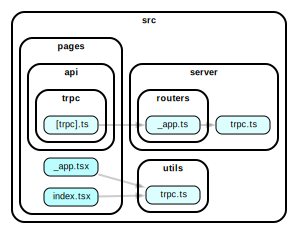
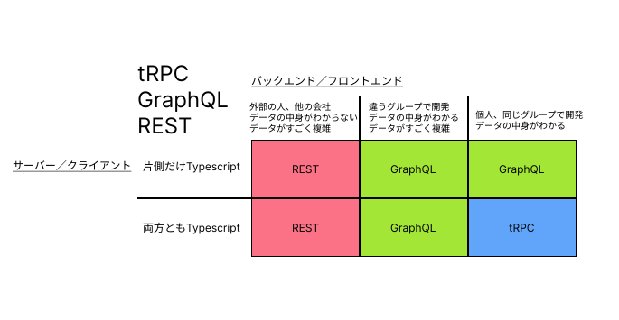
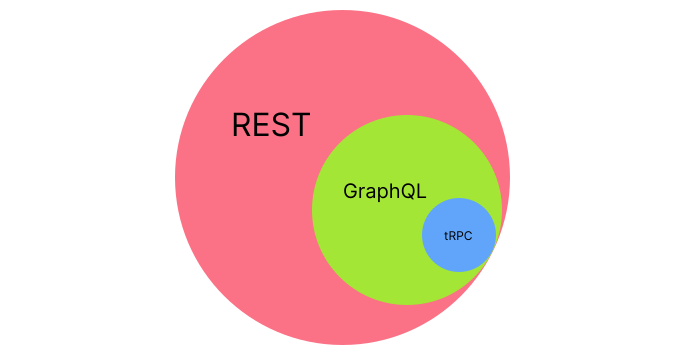

# tRPC Next.jsで使うための最小限の構成

# 準備
Windows
VSCode
Graphviz

# ツールのインストール
## Graphviz

[Download | Graphviz](https://www.graphviz.org/download/)

graphviz-7.0.6 (64-bit) EXE installer をダウンロード
インストール時に怪しいファイルですと警告が出る
exeの方がpath設定をしてくれるのでこちらを使います。
気になる方はzipファイルをダウンロードして
環境変数を自分で設定してください。


# usage

```bash
git clone https://github.com/masakinihirota/trpc_nextjs_minimum.git

npm i

npm run dev
```


## graphvizツールの初期化

```bash
npm install --save-dev dependency-cruiser
npx depcruise --init
```

依存関係の画像をsvgファイルへ出力
基本形
src以下を出力

```bash
npx depcruise src --include-only "^src" --config --output-type dot | dot -T svg > dependency-graph.svg
```

srcフォルダ以下の相関図を可視化



※ SVGファイル

Graphvizをインストールしてこのように相関関係を可視化します。


tRPCvsGraphQLvsREST


tRPCvsGraphQLvsRESTベン図
